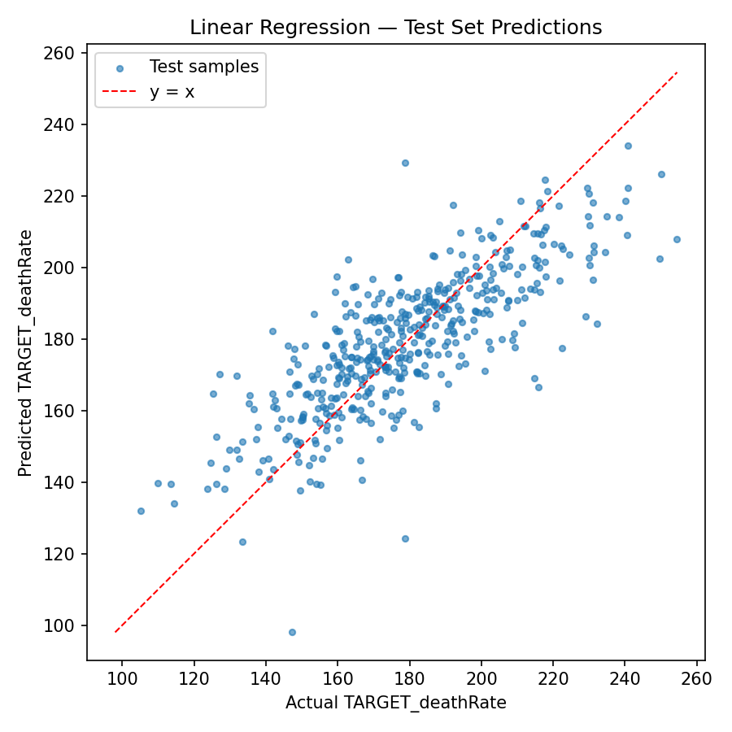

Deep Learning on Cancer Mortality Rates

This project predicts county-level cancer mortality rates from socio-demographic features using a clean preprocessing pipeline, a baseline Linear Regression, and several Deep Neural Networks (DNN) variants. It was developed as part of a deep learning homework and refactored into reusable modules.

Contents

- Overview
- Dataset
- Project structure
- Setup
- Reproducible preprocessing
- Models
- How to run
- Results
- Artifacts
- Acknowledgements

Overview
We frame the problem as regression on the label `TARGET_deathRate`. The pipeline handles missing values, categorical features, outliers, skewness, splitting, and scaling. Models are trained with consistent preprocessing and their metrics/plots are saved for comparison.

Dataset

- File: `cancer_reg-1.csv`
- Samples: 3047
- Features per sample: 33 (excluding target)
- Target: `TARGET_deathRate`

Project structure

```
2.src/
  PreProcessing.py          # preprocessing pipeline
  AnalyzeData.py            # dataset exploration helpers
  LinearRegression/
    linearregression.py     # baseline model
  DNN16/
    dnn16.py                # 1-hidden-layer DNN (16 units)
  DNN30_8/ ...              # additional DNN architectures
  DNN30_16_8/ ...
  DNN30_16_8_4/ ...
  DNN40_8/ ...
models/                     # metrics, predictions, plots, saved models
```

Setup

1) Python 3.10+
2) Install dependencies:

```
pip install -r requirements.txt
```

If you do not have a `requirements.txt`, install the essentials:

```
pip install pandas numpy scikit-learn scipy matplotlib joblib tensorflow
```

Reproducible preprocessing
Implemented in `2.src/PreProcessing.py` as class `CancerDataPreprocessor`:

- Missing values: drop `PctSomeCol18_24` (too sparse); impute numeric columns (median by default).
- Categorical: drop `Geography`; `binnedInc` can be dropped or label-encoded via a flag.
- Outliers: replace values with |z| > 3 by the column mean.
- Skewness: auto-select skewed numeric features and apply `log1p`; handle negatives safely.
- Split: Train/Val/Test = 70%/15%/15% with shuffle and fixed seed.
- Scale: `RobustScaler` on train; reuse on val/test. Alternatives: `StandardScaler`, `MinMaxScaler`.

Models

- Linear Regression baseline: `2.src/LinearRegression/linearregression.py`
- DNN-16 (1 hidden layer, 16 units): `2.src/DNN16/dnn16.py`
- Additional DNNs: `2.src/DNN30_8`, `2.src/DNN30_16_8`, `2.src/DNN30_16_8_4`, `2.src/DNN40_8`
- Loss: MSE; Metrics: MSE, R². Early stopping on validation loss.

How to run
From the project root:

```
# Baseline
python 2.src/LinearRegression/linearregression.py

# DNN-16 at multiple learning rates (saves models/metrics/plots under models/)
python 2.src/DNN16/dnn16.py
```

All scripts assume the CSV at `cancer_reg-1.csv` in the project root and will create `models/` if missing.

Results (Test set)

| Model            | Learning rate | Test MSE | Test R² |
| ---------------- | ------------- | -------- | -------- |
| LinearRegression | —            | 252.38   | 0.623    |
| DNN-16           | 0.10          | 128.31   | 0.808    |
| DNN-30-8         | 0.01          | 148.01   | 0.779    |
| DNN-30-16-8      | 0.01          | 151.59   | 0.773    |
| DNN-30-16-8-4    | 0.01          | 313.27   | 0.532    |
| DNN-40-8         | 0.01          | 144.64   | 0.784    |

Notes

- Among tested variants, DNN-16 with SGD and lr=0.1 achieved the best test R² (~0.81) in this run.
- Learning rates too small can slow convergence; too large may destabilize some deeper stacks.

Artifacts

- Best linear baseline: `3.BestModelAndLinearRegression/linear_regression_metrics.json` and `.../linear_regression_performance.png`
- One DNN-16 run: `3.BestModelAndLinearRegression/dnn16_lr_0p1_metrics.json` and `.../dnn16_lr_0p1_performance.png`
- Full sweep artifacts under `models/` (metrics JSON, plots, predictions, saved models)

Example plots



Acknowledgements

- Dataset provided for course homework.
- Built with pandas, NumPy, scikit-learn, SciPy, Matplotlib, TensorFlow/Keras.
